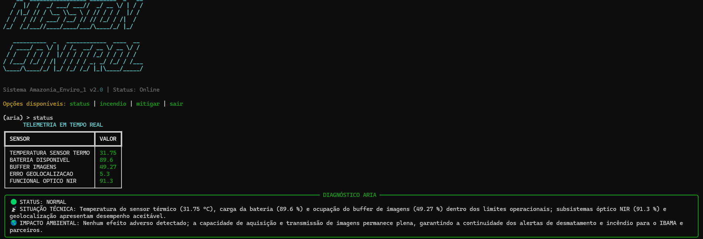

# 🚀 Mission Control AI — Amazonia_Enviro_1

> Sistema de monitoramento orbital e análise ambiental por IA generativa.
> FIAP · Ciência da Computação · Global Solution 2026.1

---

## 👨‍💻 Integrantes

| Nome | RM | Turma |
|---|---|---|
| Miguel Piedade | 572445 | 1CCPI |
| Arthur de Oliveira | 568986 | 1CCPI |
| Rafael Zani | 569033 | 1CCPI


---

## 🛰 O que o projeto faz

O **Amazonia_Enviro_1 Mission Control AI** é um sistema de monitoramento operacional que simula a telemetria de um satélite brasileiro de observação ambiental em órbita baixa (LEO). O sistema coleta dados dos sensores orbitais em tempo real, aplica lógica de detecção de anomalias em Python e aciona a **ARIA** (Análise e Resposta Inteligente Ambiental) — uma IA generativa via Ollama Cloud — para interpretar cada situação e traduzir o impacto técnico em consequências ambientais concretas para o território brasileiro.

A ARIA não apenas detecta falhas: ela conecta cada anomalia orbital ao que ela significa para a Amazônia, o Cerrado e o Pantanal — e para quem depende desses dados na Terra.

---

## 🎭 Persona atendida

**Operador do centro de controle do INPE.**

Profissional técnico que monitora o satélite em tempo real e toma decisões operacionais críticas. Ele não precisa de explicações básicas — precisa de informação clara, priorizada e acionável. A ARIA foi calibrada para esse perfil: direta, técnica e sempre conectando a falha orbital ao impacto ambiental terrestre.

---

## 🌿 Trilha

**Trilha 2 — EnviroSat (Observação Ambiental)**

Satélite simulado baseado no Amazônia-1 / Landsat, com foco em detecção de focos de incêndio, mapeamento de desmatamento e monitoramento de áreas protegidas. Os dados gerados alimentam sistemas como o DETER e o PRODES, que embasam ações do IBAMA e brigadas estaduais.

---

## 🔧 Tecnologias utilizadas

- Python 3.10+
- Ollama Cloud API — modelo `gpt-oss:120b`
- `ollama==0.6.2` — cliente oficial Python para Ollama Cloud
- `python-dotenv==1.2.2` — carregamento seguro de credenciais
- `rich==15.0.0` — interface CLI com painéis e tabelas coloridas
- `pyfiglet==1.0.4` — banner ASCII no terminal
- `prompt-toolkit==3.0.52` — input editável no terminal

---

## ▶️ Como executar

**1. Clone o repositório**
```bash
git clone https://github.com/seu-usuario/mission-control-ai.git
cd mission-control-ai
```

**2. Crie e ative o ambiente virtual**
```bash
python -m venv .venv

# Windows
.venv\Scripts\activate

# Linux/macOS
source .venv/bin/activate
```

**3. Instale as dependências**
```bash
pip install -r requirements.txt
```

**4. Configure as credenciais**

Crie um arquivo `.env` na raiz do projeto com base no `.env.example`:
```
OLLAMA_API_KEY=sua_chave_aqui
```
> Crie sua conta gratuita e gere sua chave em https://ollama.com

**5. Execute o sistema**
```bash
python main.py
```

---

## 🖥️ Comandos disponíveis na CLI

| Comando | Descrição |
|---|---|
| `status` | Coleta telemetria normal e aciona análise da ARIA |
| `incendio` | Simula cenário crítico de superaquecimento do sensor térmico |
| `ajuda` | Lista os comandos disponíveis |
| `sair` | Encerra o sistema |

---

## 📡 Parâmetros monitorados

| Sensor | Unidade | Range Normal | Crítico |
|---|---|---|---|
| Temperatura do sensor térmico | °C | 18–45 | > 60 ou < 5 |
| Bateria disponível | % | 40–100 | < 20% |
| Buffer de imagens | % cheio | 0–60 | > 85% |
| Erro de geolocalização | metros | 0–15 | > 50 |
| Sensor óptico NIR | % funcional | 85–100 | < 70% |

---

## 🧠 System Prompt

O system prompt completo da ARIA está em [`prompts/system_prompt.md`](prompts/system_prompt.md).

A ARIA foi instruída a sempre seguir o formato:

```
🔴/🟡/🟢 STATUS: [CRÍTICO / ATENÇÃO / NORMAL]

📡 SITUAÇÃO TÉCNICA:
[Descrição objetiva dos dados]

🌎 IMPACTO AMBIENTAL:
[Consequência concreta para o território brasileiro]

⚡ AÇÃO RECOMENDADA:
[O que o operador deve fazer agora]
```

---

## 🎬 Cenários de teste demonstrados

1. **Operação normal** — todos os parâmetros dentro do range, ARIA confirma status e destaca o que está sendo protegido
2. **Cenário crítico — incêndio** — sensor térmico superaquecido, bateria baixa, ARIA aciona alerta vermelho e conecta ao risco de focos não detectados
3. **Falha de downlink** — buffer cheio e bateria crítica, ARIA aciona modo de sobrevivência automático e alerta para dados do DETER em risco

---

## 💼 Proposta de valor / modelo de negócio

**1. Qual o problema real terrestre que esta missão resolve?**

O Brasil perde milhões de hectares de floresta por ano para incêndios e desmatamento ilegal. A detecção em tempo real depende de satélites funcionando corretamente — qualquer falha no sensor térmico ou no downlink significa horas de cegueira sobre o território, durante as quais focos de incêndio se alastram sem resposta das brigadas.

**2. Quem paga pela solução?**

Modelo híbrido: o setor público (INPE, IBAMA, Ministério do Meio Ambiente) financia a operação base do satélite via orçamento federal. O setor privado (seguradoras rurais, tradings do agronegócio, empresas com metas ESG) paga por acesso a dados de monitoramento para compliance ambiental e gestão de risco.

**3. Métrica de impacto**

Se o Amazonia_Enviro_1 operar 100% saudável por 1 ano: aproximadamente **500 mil km² de território monitorados continuamente**, com tempo médio de detecção de focos reduzido de 6 horas para menos de 90 minutos — o que pode evitar a perda de até **200 mil hectares de floresta** por ciclo de queimadas.

**4. Modelo de negócio**

Dado-como-serviço (DaaS): o sistema orbital gera imagens e alertas que são disponibilizados via API para órgãos públicos (subscrição governamental) e empresas privadas (assinatura por área monitorada em km²). A camada de IA generativa agrega valor ao transformar dados brutos em diagnósticos acionáveis, reduzindo a necessidade de analistas especializados para triagem inicial.

---

## 📸 Demonstração




---

## ⚠️ Limitações conhecidas

- Os dados de telemetria são simulados — não há conexão com satélites reais
- O modelo `gpt-oss:120b` via Ollama Cloud pode apresentar latência variável dependendo da carga dos servidores
- A consistência das respostas da ARIA pode variar entre execuções — recomenda-se testar o mesmo cenário mais de uma vez
- O sistema não mantém histórico de sessões anteriores entre execuções

---

## 🎥 Vídeo de demonstração

🔗 [Assistir demonstração no YouTube](https://youtu.be/uiUWDdWqJJw)

> Configurado como "Não listado" no YouTube.

---

*FIAP · Ciência da Computação · Disciplina: Prompt Engineering and Artificial Intelligence*
*Prof. Jorge Luiz Gomes*